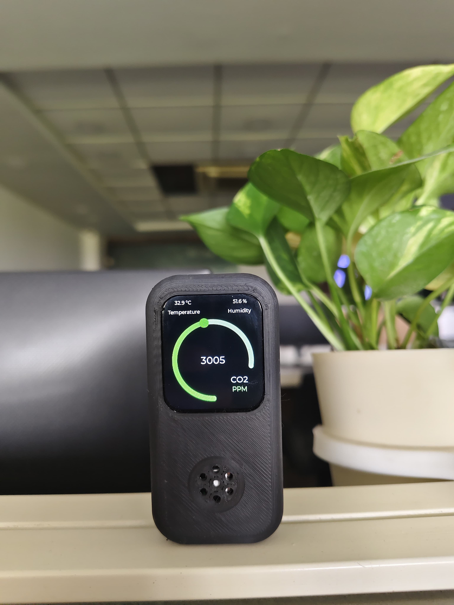

# ESP32-Based-Real-Time-CO2-Monitoring-System-with-On-Device-Display
Real-time CO₂ monitoring system using the ESP32-S3-Touch-LCD-1.69 and Sensirion SCD41 sensor. Data is displayed on a 1.69" touch screen with a custom GUI built in SquareLine Studio. Runs offline, measures CO₂, temperature, and humidity, and provides visual air quality feedback.
---

## Features

- Real-time sensing of CO₂, temperature, and humidity using the SCD41 sensor  
- Offline operation — no Wi-Fi or cloud connectivity required  
- On-device display with a 1.69" touch LCD (240×280 pixels, 262K colors)  
- Custom GUI developed with [SquareLine Studio](https://squareline.io) for intuitive visualization 
- Uses I²C communication for sensor interfacing  

---

## Hardware Used

- [Waveshare ESP32-S3-Touch-LCD-1.69](https://www.waveshare.com/wiki/ESP32-S3-Touch-LCD-1.69) 
- [Sensirion SCD41 CO₂ sensor](https://www.sensirion.com/en/environmental-sensors/carbon-dioxide-sensors-gas-sensors/co2-sensors/)

## Project Display

